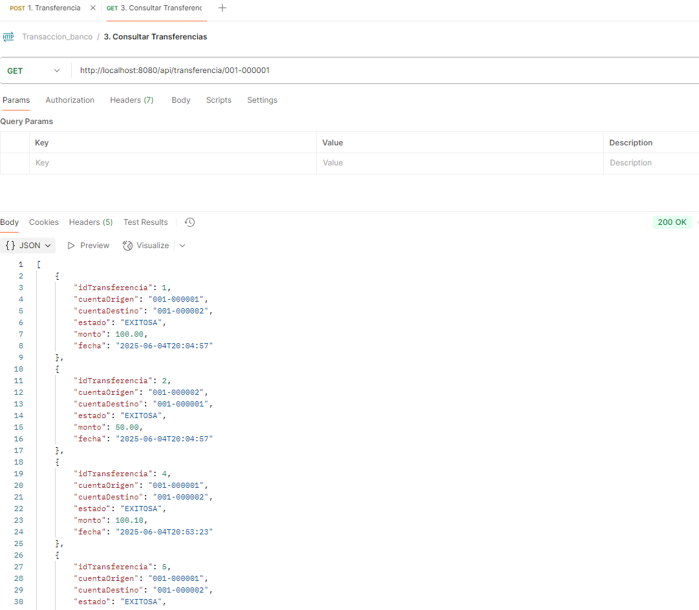

# API de Transferencia Bancaria

Este proyecto es una API REST para la gestión de transferencias bancarias internas entre cuentas del mismo banco. Está desarrollada en Java con Spring Boot y utiliza MySQL como base de datos.

## Versiones Utilizadas

- **Java:** 17
- **Maven:** 3.9.10

## Estructura del Proyecto

- **src/main/java/org/openapitools/**  
  Código fuente principal de la aplicación, incluyendo modelos, controladores, repositorios y excepciones.

- **src/main/resources/application.properties**  
  Configuración de la base de datos y parámetros de la aplicación.

- **backup/**  
  Carpeta con recursos de apoyo:
  - **transferencias.sql**: Script SQL para crear la base de datos, tablas y datos de prueba.
  - **transferencias.yaml**: Especificación OpenAPI/Swagger de la API.
  - **transferencias-collections-postman.json**: Colección de Postman para probar los endpoints de la API.
  - **openapi-generator-cli.jar**: Herramienta para generar código a partir del archivo OpenAPI.

## Endpoints Principales

- `POST /api/transferencia`  
  Ejecuta una transferencia entre dos cuentas.

- `GET /api/cuenta/{cuenta}/saldo`  
  Consulta el saldo de una cuenta específica.

- `GET /api/transferencia/{cuenta}`  
  Lista las transferencias asociadas a una cuenta (como origen o destino).

## Modelos Principales

- [`org.openapitools.model.TransferenciaRequest`](src/main/java/org/openapitools/model/TransferenciaRequest.java):  
  Representa la solicitud de transferencia.

- [`org.openapitools.model.TransferenciaResponse`](src/main/java/org/openapitools/model/TransferenciaResponse.java):  
  Respuesta tras ejecutar una transferencia.

- [`org.openapitools.model.ConsultaSaldoResponse`](src/main/java/org/openapitools/model/ConsultaSaldoResponse.java):  
  Respuesta al consultar el saldo de una cuenta.

- [`org.openapitools.model.TransferenciaItem`](src/main/java/org/openapitools/model/TransferenciaItem.java):  
  Detalle de una transferencia individual.

- [`org.openapitools.model.ErrorResponse`](src/main/java/org/openapitools/model/ErrorResponse.java):  
  Respuesta de error estándar.

## Configuración y Ejecución

1. **Base de Datos**  
   - Ejecuta el script [`backup/transferencias.sql`](backup/transferencias.sql) en tu servidor MySQL para crear la base de datos y las tablas necesarias, así como insertar datos de prueba.

2. **Configuración de la Aplicación**  
   - El archivo [`src/main/resources/application.properties`](src/main/resources/application.properties) contiene la configuración de conexión a la base de datos. Modifícalo si es necesario.

3. **Documentación y Pruebas**  
   - La especificación OpenAPI está en [`backup/transferencias.yaml`](backup/transferencias.yaml).
   - Puedes importar [`backup/transferencias-collections-postman.json`](backup/transferencias-collections-postman.json) en Postman para probar los endpoints fácilmente.
   - La documentación Swagger UI estará disponible en `http://localhost:8080/api/swagger-ui.html` (o la ruta configurada).

## Excepciones y Manejo de Errores

El proyecto incluye manejo global de errores:
- [`org.openapitools.exception.GlobalExceptionHandler`](src/main/java/org/openapitools/exception/GlobalExceptionHandler.java):  
  Captura excepciones como cuenta no existente o saldo insuficiente y retorna respuestas con mensajes claros y códigos HTTP apropiados.

## Generación de Código

Si necesitas regenerar los modelos o controladores a partir del archivo OpenAPI, puedes usar el JAR de OpenAPI Generator incluido en la carpeta `backup`.
Comando: java -jar openapi-generator-cli.jar generate -i transferencias.yaml -g spring -o transferencia-api --additional-properties=library=spring-boot,useSpringBoot3=true,interfaceOnly=true

---

## Micro proyecto de transferencias bancarias

### Modelo de Base de Datos

### Consumo de Postman - Transferencia
- Transferencia OK

- Transferencia No OK - Cuenta Origen no Existe

- Transferencia No OK - Cuenta Destino no Existe

- Transferencia No OK - Saldo insuficiente

### Consumo de Postman - Listar Transferencia
- Listar Transferencia OK

- Listar Transferencia No OK - Cuenta no Existe

### Consumo de Postman - Consultar Saldo
- Consultar Saldo OK

- Consultar Saldo No OK - Cuenta no Existe
